# SQL Queries Project

## 📌 Project Overview

This project contains SQL queries written to solve specific questions.

## 🛠️ Technologies Used

- SQL
- MySQL

## 📜 SQL Queries Based on Questions

**Question:** :Retrieve the total number of orders placed.

**Solution:**

```sql
select count(order_id) as total_orders from orders;
```

**Output:**
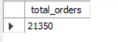

**Question:** Calculate the total revenue generated from pizza sales.

**Solution:**

```sql
SELECT 
    ROUND(SUM(orders_details.quantity * pizzas.price),
            2) AS total_sales
FROM
    orders_details
        JOIN
    pizzas ON pizzas.pizza_id = orders_details.pizza_id
```

**Output:**


**Question:** Identify the highest-priced pizza.

**Solution:**

```sql
SELECT 
    pizza_types.name, pizzas.price
FROM
    pizza_types
        JOIN
    pizzas ON pizza_types.pizza_type_id = pizzas.pizza_type_id
ORDER BY pizzas.price DESC
LIMIT 1;
```

**Output:**


**Question:** Identify the most common pizza size ordered.

**Solution:**

```sql
SELECT 
    pizzas.size,
    COUNT(orders_details.order_details_id) AS order_count
FROM
    pizzas
        JOIN
    orders_details ON pizzas.pizza_id = orders_details.pizza_id
GROUP BY pizzas.size
ORDER BY order_count DESC;
```

**Output:**
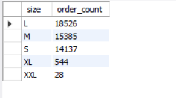

**Question:** List the top 5 most ordered pizza types along with their quantities.

**Solution:**

```sql
SELECT 
    pizza_types.name, SUM(orders_details.quantity) AS quantity
FROM
    pizza_types
        JOIN
    pizzas ON pizza_types.pizza_type_id = pizzas.pizza_type_id
        JOIN
    orders_details ON orders_details.pizza_id = pizzas.pizza_id
GROUP BY pizza_types.name
ORDER BY quantity DESC
LIMIT 5;

```

**Output:**
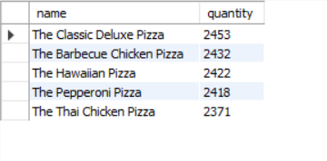

**Question:** Join the necessary tables to find the total quantity of each pizza category ordered.

**Solution:**

```sql
SELECT 
    pizza_types.category,
    SUM(orders_details.quantity) AS quantity
FROM
    pizza_types
        JOIN
    pizzas ON pizza_types.pizza_type_id = pizzas.pizza_type_id
        JOIN
    orders_details ON orders_details.pizza_id = pizzas.pizza_id
GROUP BY pizza_types.category
ORDER BY quantity DESC;
```

**Output:**
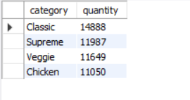

**Question:** Determine the distribution of orders by hour of the day.

**Solution:**

```sql
SELECT 
    HOUR(order_time) AS hour, COUNT(order_id) AS order_count
FROM
    orders
GROUP BY HOUR(order_time);
```

**Output:**
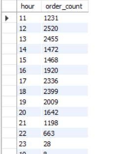

**Question:** Join relevant tables to find the category-wise distribution of pizzas.

**Solution:**

```sql
SELECT 
    category, COUNT(name)
FROM
    pizza_types
GROUP BY category
```

**Output:**
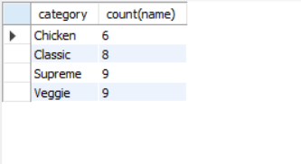

**Question:** Group the orders by date and calculate the average number of pizzas ordered per day.

**Solution:**
```sql
SELECT 
    ROUND(AVG(quantity), 0) as avg_pizza_ordered_per_day
FROM
    (SELECT 
        orders.order_date, SUM(orders_details.quantity) AS quantity
    FROM
        orders
    JOIN orders_details ON orders.order_id = orders_details.order_id
    GROUP BY orders.order_date) AS order_quantity;

```

**Output:**
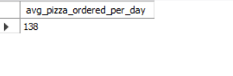

**Question:** : Determine the top 3 most ordered pizza types based on revenue.

**Solution:**

```sql
SELECT 
    pizza_types.name, SUM(quantity * pizzas.price) AS revenue
FROM
    pizza_types
        JOIN
    pizzas ON pizzas.pizza_type_id = pizza_types.pizza_type_id
        JOIN
    orders_details ON orders_details.pizza_id = pizzas.pizza_id
GROUP BY pizza_types.name
ORDER BY revenue DESC
LIMIT 3;
```

**Output:**
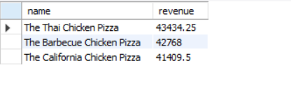

**Question:**  Calculate the percentage contribution of each pizza type to total revenue.

**Solution:**

```sql
SELECT 
    pizza_types.category,
    ROUND(SUM(orders_details.quantity * pizzas.price) / (SELECT 
                    ROUND(SUM(orders_details.quantity * pizzas.price),
                                2) AS total_sales
                FROM
                    orders_details
                        JOIN
                    pizzas ON pizzas.pizza_id = orders_details.pizza_id) * 100,
            2) AS revenue
FROM
    pizza_types
        JOIN
    pizzas ON pizza_types.pizza_type_id = pizzas.pizza_type_id
        JOIN
    orders_details ON orders_details.pizza_id = pizzas.pizza_id
GROUP BY pizza_types.category
ORDER BY revenue DESC;
```

**Output:**
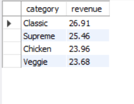

**Question:** Analyze the cumulative revenue generated over time.

**Solution:**

```sql
select order_date,
sum(revenue) over (order by order_date) as cum_revenue
from
(select orders.order_date,
sum(orders_details.quantity * pizzas.price) as revenue
from orders_details join pizzas
on orders_details.pizza_id = pizzas.pizza_id
join orders
on orders.order_id = order_details_id
group by orders.order_date) as sales;
```

**Output:**
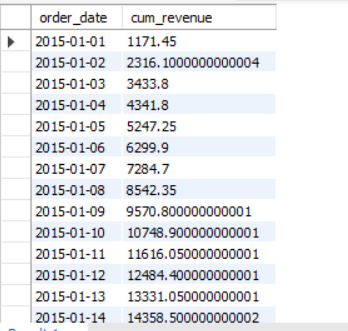

**Question:** Determine the top 3 most ordered pizza types based on revenue for each pizza category.

**Solution:**

```sql
select name, revenue from
(select category, name, revenue,
rank() over(partition by category order by revenue desc) as rn
from
(select pizza_types.category, pizza_types.name,
sum((orders_details.quantity)* pizzas.price)as revenue
from pizza_types join pizzas
on pizza_types.pizza_type_id = pizzas.pizza_type_id
join orders_details
on orders_details.pizza_id = pizzas.pizza_id
group by  pizza_types.category, pizza_types.name) as a) as b
where rn <= 3;
```

**Output:**
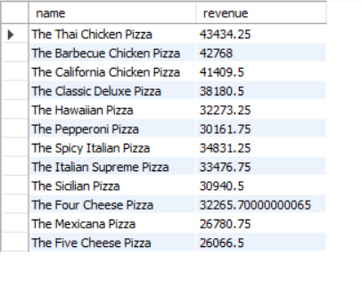
